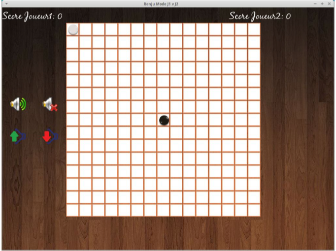

Realization:  A Renju game that is played alone or in pairs. We used Code::Blocks with SFML library (C++).

Please kindly notice that the game was created during my second year of bachelor at Université de Montpellier in France. We were a team of 4 people and had (at the time) written classes and comments in French.

Objectives:

- Create a game where two players can play a game of Gomoku.
- Implement the MinMax algorithm so that a player can play alone against an AI
- Improve the MinMax algorithm using the alpha-beta pruning technique
- Implement a specific variant of Gomoku (Renju)

Classes:

Below are the different classes of our game.

- Pions: A cell may have a pion
- Cellule: A grid is composed of cells
- Grille: Our Gomoku grid
- Curseur: Get where the cursor is
- IA: Algorithm MinMax, Alpha-beta pruning
- Joueur: Our player
- Menu: Main menu when you start the game  

I encourage you to see the code for more details.

Personal note: 
  I am reviewing this 3 years later and the first thing that came up was "OMG, that was a lot of work!". Just reading again the report, and seeing the number of classes we have created made me realize how many efforts we put on it. Plus I confess that I read again our Facebook conversation (memories, memories :3), and we were trully overbooked! Back to this time, we had to choose a project, and we chose the hardiest one I think. We had no idea of Game Theory, game engines... we just created something from skretch with C++ (thanks to SFML of course). But we did it, and we did it very well!
  Still, the code needed more comments, and the report is horrible ahah! It is more like a documentation (written is a weird way) meaning cool for people that want to understand the code but bad for presenting to someone that is not in Computer Science. But I can reassure you, since that we all grew up in term of writting (YouMark project is a good example of that)!
  I am very proud of what we did, I don't know why this project is in my heart, but well.. it is.
